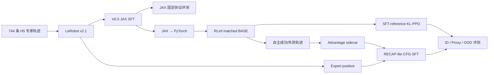

# RoboBenchMart PickToBasket SFT + KL-PPO + RECAP-lite 全流程项目

[自定义改动索引](CUSTOM_CHANGES.md) · [SFT 源码包](sft/README.md) · [完整项目总结](docs/rbm_resume_and_interview_project_summary.md) · [运行手册](docs/rbm_post_training_fixes_and_runbook.md)

这个仓库是一个个人研究工程项目，目标是在 **RoboBenchMart PickToBasket** 任务上，为 **OpenPI pi0.5** 建立一条完整的后训练链路：

```text
PickToBasket SFT
-> JAX checkpoint 评测
-> JAX checkpoint 转 PyTorch checkpoint
-> RLinf rollout / eval
-> SFT-reference KL-PPO 小规模闭环强化
-> 失败 episode 分析
-> correction data / RECAP-lite weighted SFT
-> train / robo / unseen / OOD 四类场景评测
```

这个项目的起点是一个已经完成 20000 步 SFT 的 OpenPI pi0.5 PickToBasket 模型。SFT 对 in-domain 任务有提升，但问题是：能不能继续用闭环强化学习让模型在 in-domain 和 OOD 任务上都更好，同时不破坏 SFT 已经学到的抓取、移动、放置能力。

这个仓库记录的就是为了回答这个问题，在 RLinf 中打通 OpenPI + RoboBenchMart + PPO 后训练所做的代码、配置、脚本和技术分析。

它不是模型权重发布仓库。checkpoint、训练日志、视频、数据集和仿真资产都不会放进仓库。

## 核心结果与项目价值

| 阶段 | 固定协议结果 | 结论 |
|---|---:|---|
| 官方 π0.5 JAX BASE | ID 43/90（47.8%） | 具备基础抓取能力 |
| 20k-step JAX SFT | ID 67/90（74.4%） | SFT 提升 26.6 个百分点 |
| PyTorch matched SFT BASE | ID 59/90 | 后训练的公平对照基线 |
| KL-PPO 首次 actor update | ID 60/90 | 净增 1 条，不构成可靠提升 |
| RECAP-lite 旧 mixed step 5 | ID 52/90 | 低于 BASE，定位出采样和信号问题 |

SFT 明确提升了三个训练商品，但 OOD 从 5/60 降到 2/60，说明模型产生专门化。后续
KL-PPO 和 RECAP-lite 没有获得可靠 OOD 提升，但完成了真实 rollout、反向传播、保存、
恢复、数据采集和 fixed-seed 评测，并定位了训练/评测去噪不一致、critic 信号不足、
长失败轨迹采样偏置、reference 生命周期和显存峰值等问题。

本项目主要体现以下能力：

- VLA、flow matching、action chunk 与连续动作 logprob；
- SFT、PPO、GAE、value learning、reference KL 与 CFG-SFT；
- H5→LeRobot 数据工程和自主 rollout 数据闭环；
- Ray/FSDP 分布式训练、JAX/PyTorch checkpoint 对齐和 CUDA OOM 调试；
- fixed-seed 对照、消融、训练门控和负实验归因。

## 系统路线



## 这个仓库是什么

如果希望先理解项目背景、KL-PPO 与 RECAP-lite，再阅读配置和代码，请从
[面向初学者的项目总结](docs/rbm_resume_and_interview_project_summary.md) 开始。该文档
按照“任务与数据 → SFT → JAX/PyTorch 对齐 → KL-PPO → RECAP-lite → 实验结论”的顺序，
结合公式解释关键变量、实现选择和负实验结果。

这个仓库连接了三个系统：

```text
OpenPI         pi0.5 模型、SFT 训练、JAX checkpoint
RoboBenchMart  PickToBasket 仿真任务和评测环境
RLinf          PyTorch rollout、PPO actor/value 训练、分布式 worker
```

主要工作不是重新写一个 PPO 算法，而是把完整链路打通并排查清楚：

1. 用 OpenPI pi0.5 在 RoboBenchMart PickToBasket demonstration 上做 SFT。
2. 在官方 JAX/OpenPI 路径中评测 SFT checkpoint。
3. 把 JAX checkpoint 转成 RLinf 可加载的 PyTorch checkpoint。
4. 在 RLinf 中做 matched eval，确认转换后的模型行为仍然合理。
5. 在 RLinf 中跑保守 PPO，包含 action、logprob、value、old_logprob、advantage 和 SFT-reference KL。
6. 每个 PPO checkpoint 都和 SFT baseline 对比，而不是只看 reward 是否变大。
7. 用失败 rollout 生成 correction 数据，为后续 RECAP-lite / weighted SFT 做准备。

## 为什么要做这个项目

单纯 SFT 通常能提高训练分布内任务，但对 unseen / OOD 的泛化不一定稳定。闭环 RL 看起来很适合机器人任务，因为模型可以和环境交互，根据真实任务反馈继续优化。

但直接在一个已经比较强的 SFT 机器人策略上做 PPO 很容易出问题：

- reward 可能稀疏，或者和最终 success rate 不完全一致。
- shaped reward 可能被模型“钻空子”，例如只学会夹起物体但不放进篮子。
- PPO clip 只约束当前策略和 rollout old policy 的距离，不能保证多轮训练后仍然接近最初 SFT 模型。
- JAX eval 和 PyTorch rollout 的动作、图像、seed、action chunk 只要有一点不一致，PPO 就可能在错误链路上优化。

因此这个项目中，PPO 的定位是：

```text
小规模、保守、用于验证链路和暴露失败模式的闭环强化 probe。
```

更稳的下一步不是直接长训 PPO，而是：

```text
用 eval / PPO rollout 找失败模式 -> 构造 correction 数据 -> 做 RECAP-lite / weighted SFT。
```

## 整体技术路线

```text
阶段 0：OpenPI / RoboBenchMart SFT
  用 OpenPI JAX trainer 在 PickToBasket demonstration 上训练 pi0.5。

阶段 1：SFT 评测与 checkpoint 转换
  先在 JAX 路径评测 SFT checkpoint，再转成 RLinf PyTorch checkpoint。

阶段 2：RLinf matched eval
  用转换后的 PyTorch checkpoint 做确定性评测，并和 JAX 行为对齐。

阶段 3：SFT-reference KL-PPO
  小规模 PPO probe，训练 value，计算 old_logprob / current logprob / advantage，并加入 SFT reference KL。

阶段 4：失败 episode 收集
  保存失败视频、动作轨迹、任务 id、seed 和 reward 信息，用于分析失败原因。

阶段 5：RECAP-lite / weighted SFT
  把成功和修正后的失败 episode 组织成带权重的 SFT 数据。

阶段 6：统一评测
  在 train / robo / unseen / OOD 四类 split 上评测，并始终和 matched SFT baseline 对比。
```

## 仓库关键内容

```text
rlinf/envs/robobenchmart/
  RLinf EnvWorker 使用的 RoboBenchMart 环境 wrapper。

rlinf/envs/robobenchmart/robobenchmart_env.py
  PickToBasket 观测映射、任务选择、reset、seed 对齐、视频/debug hook 和 shaped reward。

rlinf/envs/robobenchmart/proxy_tasks.py
  proxy task 定义。用于训练时增加物体和布局变化，同时避免把 Nestle/Slam/Duff 这类 OOD 任务直接放进 PPO 训练。

rlinf/models/embodiment/openpi/dataconfig/robobenchmart_dataconfig.py
  RLinf 侧的 RoboBenchMart OpenPI data config。

rlinf/models/embodiment/openpi/policies/robobenchmart_policy.py
  把 RoboBenchMart observation/action 转成 OpenPI 模型输入输出的 policy adapter。

rlinf/workers/actor/fsdp_actor_worker.py
  在 embodied PPO actor 中加入真正的 SFT-reference KL 约束。

examples/embodiment/config/rbm_pick_to_basket_ppo_openpi_pi05.yaml
  PickToBasket 主 PPO / eval 配置。

examples/embodiment/config/rbm_pick_to_basket_proxy_mix_ppo_openpi_pi05.yaml
  proxy-mix PPO 配置。

examples/embodiment/config/env/robobenchmart_pick_to_basket_*.yaml
  train、proxy、unseen、OOD 风格环境 split。

scripts_local/06_rbm_ppo_smoke.sh
scripts_local/07_rbm_ppo_proxy_mix.sh
  本地 smoke 和 proxy-mix PPO 启动脚本。

scripts_local/08_rbm_collect_jax_action_trace.py
scripts_local/09_compare_rbm_action_traces.py
  JAX policy 和 RLinf PyTorch policy 动作轨迹对比工具。

docs/rbm_stage1_rlinf_ppo_smoke_adaptation.md
  RLinf PPO 适配和 smoke 阶段记录。

docs/rbm_true_kl_ppo_and_reward_changes.md
  SFT-reference KL-PPO 和 PickToBasket reward 修改的详细解释。
```

## SFT 阶段

OpenPI 侧 RoboBenchMart SFT config 是：

```text
pi05_sft_rbm_pick_to_basket
```

本地实验设置：

```text
模型：OpenPI pi0.5
任务：RoboBenchMart PickToBasket
action_dim：13
训练步数：20000 steps
checkpoint 格式：OpenPI / JAX checkpoint
```

SFT checkpoint 必须先在 JAX/OpenPI 原始路径中评测。原因是：如果 SFT 自己都没有正确跑通，就不能进入 PPO；如果转换前后行为不一致，后续 PPO 的结果也没有意义。

## SFT 源码与 Checkpoint 转换

### 已补充的 SFT 源码

本仓库现在包含独立的 [`sft/`](sft/README.md) 源码包：

```text
sft/convert_pick_to_basket_h5_to_lerobot.py
sft/openpi/robobenchmart_policy.py
sft/openpi/openpi_rbm_sft_config.patch
sft/docs/RBM_OpenPI_SFT_Adaptation.md
sft/docs/RBM_OpenPI_SFT_20k_Training_Report.md
```

其中包括 H5→LeRobot 转换器、三视角 OpenPI policy adapter、`LeRobotRBMDataConfig`、
`pi05_eval_rbm`、`pi05_sft_rbm_pick_to_basket` 配置补丁，以及完整训练报告。这样既能
审查 SFT 自定义代码，又不需要在 RLinf 主包中复制整套 OpenPI 源码。

各阶段相对上游的修改位置见 [`CUSTOM_CHANGES.md`](CUSTOM_CHANGES.md)。

RLinf 的 PPO 路径使用 PyTorch OpenPI 模型，因此需要把 SFT JAX checkpoint 转成 PyTorch checkpoint：

```bash
python rlinf/utils/ckpt_convertor/convert_openpi_jax_to_python.py \
  --checkpoint_dir /path/to/openpi_jax_sft_checkpoint/19999 \
  --output_path /path/to/rbm_pi05_sft_pytorch \
  --config_name pi05_eval_rbm
```

注意：

```text
SFT 训练 config：pi05_sft_rbm_pick_to_basket
评测/转换 config：pi05_eval_rbm
```

之前如果用 `pi05_rbm` 会报错，因为 OpenPI 里没有这个 config。

## PPO 阶段需要哪些量

PPO 不是只需要 action 和 reward。完整链路需要：

```text
action
logprob
value
old_logprob
ref_logprob
advantage
KL penalty
```

在这个项目里：

- `action`：rollout policy 在环境交互时采样出来的动作。
- `old_logprob`：采样这个 action 时，rollout policy 给出的 log probability。
- `value`：actor/value 模型对当前状态的价值估计。
- `advantage`：由 reward 和 value 计算出来，用于告诉 PPO 哪些动作比预期更好。
- `logprob`：PPO update 时，当前 actor 对同一批 action 重新计算的 log probability。
- `ref_logprob`：冻结的 SFT 初始模型对同一批 action 重新计算的 log probability。
- `KL(current, SFT)`：限制 PPO 后的当前模型不要偏离 SFT 模型太远。

最终 loss 变成：

```text
loss = PPO actor/value loss + kl_beta * reference_KL(current_logprob, ref_logprob)
```

这和普通 PPO 的 `approx_kl` 不一样：

```text
approx_kl：current policy vs rollout old policy
ref_kl：current policy vs 初始 SFT reference policy
```

你的技术路线里真正需要的是第二个，因为目标是“在 SFT 附近做保守闭环强化”。

## PickToBasket reward 设计

当前 reward 是事件型 + 进度型：

```text
+5.00 * success
+1.00 * first_placed
+0.30 * first_lifted
+0.50 * positive_progress_to_basket
+0.30 * first_placed_static
-0.20 * first_non_target_displacement
```

设计思路：

- `success` 权重最大，保证最终目标还是完成任务。
- `first_placed` 比 `first_lifted` 更大，因为放进篮子比夹起来更接近成功。
- `first_lifted` 只给一次，避免模型靠反复夹起刷 reward。
- `positive_progress_to_basket` 只奖励比历史更靠近篮子的正向进展，避免停在篮子附近刷分。
- `first_placed_static` 鼓励放入后稳定，避免刚碰到篮子就掉出。
- `first_non_target_displacement` 轻量惩罚扰动非目标物体。


## RECAP-lite：从自主成功/失败经验继续学习

完整 RECAP 使用 demonstrations、on-policy experience、value advantage 和专家
correction。本项目实现 RECAP-lite：专家数据视为 positive；SFT policy 的自主轨迹按
最终 success 标为 positive/negative，再进行 CFG flow-matching SFT。

```text
原始任务 prompt + "Advantage: positive"
原始任务 prompt + "Advantage: negative"

v_guided = v_uncond + w * (v_positive - v_uncond)
```

数据闭环包括：

1. `09_rbm_collect_indomain_rollouts.sh`：三个 ID task 各采 30 条，共 90 episodes；
2. `09_rbm_repair_rollout_schema.py`：统一第三视角字段并原子迁移旧 shard；
3. `make_recap_lite_advantages.py`：生成 frame/episode 对齐的 advantage sidecar；
4. `cfg_model.py`：加载 advantage，实现 episode-balanced 与 label quota；
5. `openpi_cfg_action_model.py`：正负 prompt、conditional dropout 和 CFG inference；
6. `11_rbm_recap_cfg_mixed.sh`：混合 SFT 与 rollout 数据训练；
7. `12_rbm_recap_eval_checkpoint.sh`：固定协议评测 CFG checkpoint。

| 任务 | 成功 | 失败 |
|---|---:|---:|
| Fanta | 15 | 15 |
| Nivea | 23 | 7 |
| Stars | 21 | 9 |

最初按帧采样时，600-step 失败 episode 因更长而获得过高概率。最终改为先选择数据源、
任务和正负配额，再选择 episode 和帧，确保短训覆盖全部 task/label 组合。

关键代码：

- [`examples/recap/process/make_recap_lite_advantages.py`](examples/recap/process/make_recap_lite_advantages.py)
- [`rlinf/data/datasets/recap/cfg_model.py`](rlinf/data/datasets/recap/cfg_model.py)
- [`rlinf/models/embodiment/openpi_cfg/openpi_cfg_action_model.py`](rlinf/models/embodiment/openpi_cfg/openpi_cfg_action_model.py)
- [`examples/recap/cfg/config/rbm_pick_to_basket_recap_lite_cfg_openpi_pi05.yaml`](examples/recap/cfg/config/rbm_pick_to_basket_recap_lite_cfg_openpi_pi05.yaml)

## 代码完整度与复现边界

| 模块 | 状态 | 说明 |
|---|---|---|
| SFT 自定义代码 | 已补齐 | 转换器、policy、OpenPI patch、适配文档和报告均在 `sft/` |
| RLinf checkpoint 接入 | 完整 | 转换、加载、matched eval 和 action trace |
| KL-PPO | 完整 | 算法、配置、训练、安全门控、测试和评测 |
| RECAP-lite | 完整 | 采集、schema、标签、采样、CFG 训练和评测 |
| 完整 RECAP | 未实现 | 当前不含专家 correction 和完整 value pipeline |
| 数据、权重与资产 | 未公开 | 体积较大，需遵循上游许可单独获取 |

## 当前结论

当前最重要的结论是：

```text
SFT 是可靠 baseline。
直接 PPO 很脆弱。
reward 变大不等于 success rate 变高。
没有 SFT-reference KL 的 PPO 结果不可信。
更值得继续的是 failure correction / RECAP-lite weighted SFT。
```

已有实验中，PPO probe 没有稳定超过 SFT baseline。因此这个仓库不会把 PPO 包装成已经完成的性能提升，而是把它作为后训练链路、失败模式分析和 correction 数据生成的一部分。

## 不包含哪些内容

仓库不会包含：

```text
模型 checkpoint
训练 logs
TensorBoard event files
评测视频
RoboBenchMart assets
ManiSkill assets
OpenPI cached assets
本地虚拟环境
私有数据集
```

这些文件体积大、路径依赖强，或者不适合放到公开 GitHub 仓库。

## 最小复现目录结构

建议本地目录：

```text
/path/to/RLinf
/path/to/openpi
/path/to/RoboBenchMart
/path/to/ManiSkill
/path/to/rbm_pi05_sft_pytorch
```

环境变量：

```bash
export PYTHONPATH=/path/to/RLinf:/path/to/RoboBenchMart:/path/to/openpi:${PYTHONPATH:-}
export MODEL_PATH=/path/to/rbm_pi05_sft_pytorch
export OMP_NUM_THREADS=1
```

PPO smoke：

```bash
bash scripts_local/06_rbm_ppo_smoke.sh
```

proxy-mix PPO：

```bash
bash scripts_local/07_rbm_ppo_proxy_mix.sh
```

动作轨迹对比：

```bash
python scripts_local/09_compare_rbm_action_traces.py \
  /path/to/jax_trace.npz \
  /path/to/rlinf_trace_dir \
  --stage-id 0 \
  --atol 1e-4
```

## 项目状态

这是一个研究工程仓库，适合展示从 SFT 到 RL 后训练的完整链路、排错过程和保守 KL-PPO 的设计理由。它不是最终 benchmark checkpoint 发布，也不声称 PPO 已经稳定超过 SFT。
